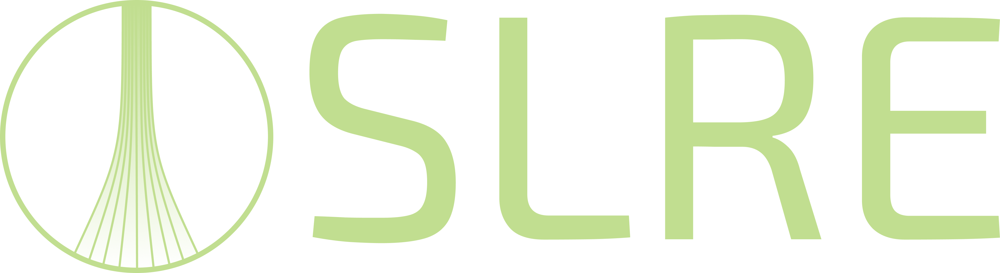

<div align="center">
    
</div>
<div align="center">
    <p><b>S</b>imulation of <b>L</b>iquid <b>R</b>ocket <b>E</b>ngines</p>
    <p>(Pronounced "Celery")</p>
</div>

---

SLRE is a Python package that provides simulation tools for the preliminary design of liquid rocket engines.

---

## Features

Features include:
- Integrated CEA analysis through [rocketcea.py](https://github.com/sonofeft/RocketCEA)
- Integrated thermodynamic property querying through [CoolProp](http://www.coolprop.org/)
- Generation of nozzle geometry (conical or Rao bell nozzle approximation)
- Generation of combustion chamber geometry
- One-dimensional regenerative cooling analysis
- Engine cycle analysis

---

## Installation

SLRE is still under early and active development. Installation is not recommended at this time

---

## Example of Usage

SLRE has been designed to be quick and easy to use.

For example, consider an engine with the following parameters:

To begin, a thrust chamber object is created:

```Python
engineThrustChamber = ThrustChamber(fuelName='methane', oxName='oxygen', thrust=10*10**3, chamberPressure=40, fac=True, contractionRatio=3, ambientPressure=1.01325)
```

The combustion chamber and nozzle geometry for the thrust chamber is then generated, then combined into the overall thrust chamber geometry:

```Python
engineThrustChamber.getChamberGeometry(lStar=2.25,
                                       contractionLength=0.065, 
                                       numberOfPointsConverging=100,
                                       numberOfPointsStraight=50)
testThrustChamber.getRaoBellNozzleGeometry(0.8, numberOfPoints=100)
testThrustChamber.getThrustChamberCoords()
```

This engine involves regenerative cooling so parameters for the solver are now defined:

```Python
solverParameters = SolverParameters(bartzEquationCoefficient=0.023*0.33, coolantSideHeatTransferCorrelation="sieder-tate")
```

To perform a regenerative cooling analysis, the cooling channels are defined, then fed into a regenerative cooling object along with the thrust chamber and solver paramters:

```Python
engineCoolingChannels = CoolingChannels(numberOfChannels=96, wallThickness=0.9e-3, midRibThickness=1.5e-3, channelHeight=1.25e-3, wallConductivity=365, wallRoughnessHeight=1e-6)
engineRegenerativeCooling = RegenerativeCooling(thrustChamber=testThrustChamber, coolingChannels=testCoolingChannels, solverParameters=solverParameters)
```

To perform a cycle analysis, the state of the propellants in the tank are defined and Tank objects created to represent them:

```Python
fuel = Propellant(testThrustChamber.fuel.name)
ox = Propellant(testThrustChamber.ox.name)

fuel.defineState("T", 108, "P", 3*10**5)
ox.defineState("T", 60, "P", 3*10**5)

fuelTank = Tank(fuel)
oxTank = Tank(ox)
```

Other components can be defined e.g:

```Python
fuelPump = Pump(isentropicEfficiency=0.7, outletPressure=70e5)
turbine = Turbine(isentropicEfficiency=0.7, outletPressure=testThrustChamber.injectionPressure*10**5)

oxPump = Pump(isentropicEfficiency=0.7, outletPressure=testThrustChamber.injectionPressure*10**5)
```

These can then be combined together to form their respective lines in the cycle:

```Python
fuelLine = Line(inletState=fuelTank.outletState, massFlowRate=engineThrustChamber.fuelMassFlowRate, components=[fuelPump, engineRegenerativeCooling, turbine])
oxLine = Line(inletState=oxTank.outletState, massFlowRate=thrustChamber.oxMassFlowRate, components=[oxPump])
```

The cycle is then formed from these lines:

```Python
cycle = Cycle(fuelLine=fuelLine, oxLine=oxLine, thrustChamber=engineThrustChamber)
```

---

## Development

Roadmap is available to see on Trello: https://trello.com/invite/b/ggmVsmHZ/e12b9fa45032be39d1646497120369d0/slre-roadmap

